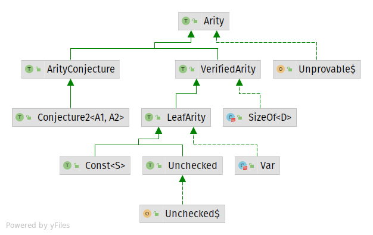
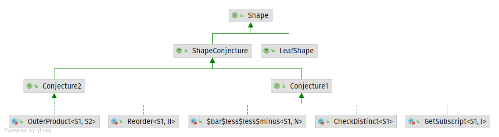

**shapesafe** is the one-size-fits-all compile-time verifier for numerical linear algebra on JVM, obvious shape and indexing errors in tensor operations are captured by scala's typing system.

Shapesafe allows programs to actively prove themselves while being written. The following capabilities are enabled in release v0.1.0:

##### static & runtime-dependent tensor shapes of arbitrary rank


##### named tensor: each dimension is indexed by both its name and ordinal number


##### tensor contractions & operations that depends on index equality, (all cases of EinSum, dot/cross/matrix/hadamard product)


##### operations that depends on shape arithmetics (convolution, direct sum, kronecker product, flatten/reshape)


##### complex function composition, with no implicit scope


These screenshots can be reproduced by compiling our showcases in Visual Studio Code + Scala (Metals) plugin:

- [Part 1](https://github.com/tribbloid/shapesafe-demo/blob/main/src/main/scala/shapesafe/demo/core/ShowCase.scala)
  - [Part 1 - error captured](https://github.com/tribbloid/shapesafe-demo/blob/main/src/main/scala-shouldFail/shapesafe/demo/core/ShowCase_Refute.scala)
- [Part 2](https://github.com/tribbloid/shapesafe-demo/blob/main/src/main/scala-complex/shapesafe/demo/core/ShowCase_Complex.scala)
  - [Part 2 - error captured](https://github.com/tribbloid/shapesafe-demo/blob/main/src/main/scala-shouldFail/shapesafe/demo/core/ShowCase_RefuteComplex.scala)

**It is not a tensor computing library!** Instead, it is designed to be embedded into existing libraries to enable less error-prone prototyping (see Roadmap for possible augmentations).

shapesafe started as an experiment to understand intuitionistic type theory used in compiler design, it minimally depends on [singleton-ops](https://github.com/fthomas/singleton-ops) and [shapeless](https://github.com/milessabin/shapeless).

Support for scala-2.13 is always guaranteed, supports for scala-2.12 or scala-js should only be enforced intermittently and upon request, please create (or vote for) tickets to backport for a specific compiler.

### Build Status

| branch \ profile | Scala-2.13                                                                                 | Scala-2.13 w/ splain plugin                                                                       |
| ---------------- |--------------------------------------------------------------------------------------------|---------------------------------------------------------------------------------------------------|
| master           |          |          |
| 0.1.1            |  |  |
| 0.1.0            |  |  |
| dev (latest WIP) |                        |                 |

### Tutorial

- Setup `shapesafe-core` in your scala project [using your favourite dependency manager](https://search.maven.org/artifact/ai.acyclic.shapesafe/shapesafe-core_2.13/0.1.0/jar). Replace the version number with that of the latest compatible release 

- Compile our [Casually Written Tutorial](https://github.com/tribbloid/shapesafe-demo/blob/main/src/main/scala-shouldFail/shapesafe/demo/core/Tutorial.scala) and learn the basics by reading code and errors.
  
  - The [shapesafe-demo](https://github.com/tribbloid/shapesafe-demo) project provides a reference setup using sbt
  - Our Scastie snippet (courtesy of EPFL Scala Center) uses the same setup but can run in browser
    - [Part 1](https://scastie.scala-lang.org/tribbloid/RL1BZ0YTR9WyH4MBw624tA/10)
    - [Part 2](https://scastie.scala-lang.org/tribbloid/hB9EyCVWQvilD20DcFq7wg/3)

### Roadmap

##### High priority

- Symbolic reasoning for variable dimensions, using Ring/Field axioms and natural deduction
- Type-checking for [EinOps](https://openreview.net/forum?id=oapKSVM2bcj)
- DJL integration

##### Low priority

- DL4j & ND4j integration
- breeze integration (only tensors to up to rank-2 is required)

### How to compile

In POSIX shell, run `./dev/make-all.sh`

Guaranteed to be working by [Continuous Integration](.github/workflows/main.yml)

You must have installed a JDK that supports Gradle 7+ before the compilation

### Architecture (Recommended for user who finished our tutorial)

##### Lazy Verification

It can be observed immediately in the tutorial that calling functions in shapesafe
requires no implicit summoning of type class. In fact, their return types are represented as computation graphs rather than computed Arities or Shapes.
As a trade-off, errors in these computation graphs can't be detected as-is:

```scala
val a = Shape(1, 2)
val b = Shape(3, 4)
val s1 = (a >< b).:<<=*("i", "j")
s1.peek

// [INFO] 1 >< 2 >< (3 >< 4) :<<= (i >< j)
```

This is a deliberate design which allows complex operand compositions to be defined with no boilerplate (see [example above](#complex-function-composition-with-no-implicit-scope) and [the other example in the tutorial](https://github.com/tribbloid/shapesafe-demo/blob/db19e1a5c05ff302308a5744bedbe65dd9f62a5d/src/main/scala-shouldFail/shapesafe/demo/core/Tutorial.scala#L59)).

Detection of errors only happens once the expression is evaluated (by explicitly calling `.eval` or `.reason`), which summons all algebraic rules like a proof assistant:

```scala
s1.eval

// [ERROR] Dimension mismatch
//   ...
```

In the above example, calling `eval` instructs the compiler to summon a series of type classes as lemmata to prove / refute the correctness of the expression:

| lemma                                         |     | expression                              |
| ---------------------------------------------:|:---:| --------------------------------------- |
|                                               |     | (1 >< 2) **><** (3 >< 4) \:<<= (i >< j) |
| (prove outer product)                         | =   | 1 >< 2 >< 3 >< 4 **\:<<=** (i >< j)     |
| (refute naming of tensor: Dimension mismatch) | !   |                                         |

Evidently, `eval` can only be used *iff.* each shape operand in the expression (in the above example `a` and `b`)  is
either already evaluated, or can be evaluated in the same scope. This is the only case when implicit arguments has to be
declared by the user.

At this moment, all algebraic rules are defined to manipulate the following 2 types of expressions:

- **Arity** - describing 1D vectors:



- **Shape** - describing ND tensors:



Shapesafe works most efficiently if dimensions of all tensors are either constants (represented
by `shapesafe.core.arity.Const`), or unchecked (represented by `shapesafe.core.arity.Unchecked`, meaning that it has no
constraint or symbol, and should be ignored in validation). In practice, this can reliably support the majority of
applied linear algebra / ML use cases. Support for symbolic algebra for shape variables (represented
by `shapesafe.core.arity.Var`) will be gradually enabled in future releases.

##### Upgrade to Scala 3

Most features in shapeless & singleton-ops are taken over by native compiler features:

- shapeless.Witness → singleton type
- shapeless.Poly → polymorphic function
- singleton.ops.== → inline conditions & matches
- singleton.ops._ → scala.compiletime.ops.*
- shapeless.HList → Tuple
- shapeless.record → Programmatic Structural Types

... but some are still missing:

- Product to Tuple conversion, plus its variants:
  - shapeless.NatProductArgs
  - shapeless.SingletonProductArgs
- ecosystem: Apache Spark, CHISEL, LMS, typelevel stack, and much more

Scala 3/dotty appears to be vastly more capable as a "proof assistant", with 15~20x speed improvement over Scala 2 on
implicit search. This seems to indicate that shapesafe could only achieve large scale, production-grade algebraic
verification after the upgrade is finished. At this moment (with Scala 2.13), if the implicit search on your computer is
too slow, consider breaking you big operand composition into multiple small ones, and evaluate in-between as often as
possible.

##### Extra Read

- Slide in SBTB2021: https://github.com/tribbloid/shapesafe-demo/raw/main/__presentations/SBTB2021/slide.pdf

### Credit

- [Prof. Dmytro Mitin](https://www.researchgate.net/profile/Dmytro-Mitin) at National Taras Shevchenko University of
  Kyiv
- All maintainers of [singleton-ops](https://github.com/fthomas/singleton-ops)
- All maintainers of [shapeless](https://github.com/milessabin/shapeless)
- All maintainers of [splain](https://github.com/tek/splain)
- Breandan Considine, maintainer of [Kotlin∇](https://openreview.net/forum?id=SkluMSZ08H)

This project is heavily influenced by Kotlin∇ (see discussion [here](https://github.com/breandan/kotlingrad/issues/11))
and several pioneers in type-safe ML:

- Evan Spark for [first showing the possibility](https://etrain.github.io/2015/05/28/type-safe-linear-algebra-in-scala)
- Tongfei Chen et al. for [Nexus](https://github.com/ctongfei/nexus)
- Dougal Maclaurin et al. for [Dex](https://github.com/google-research/dex-lang)
- Maxime Kjaer et al. for [tf-dotty](https://github.com/MaximeKjaer/tf-dotty)

$$
\frac{\mathrm{S} \mathrm{H} \mathrm{A} \mathrm{P} \mathrm{E}}{\: \mathrm{S} \: \forall \mathrm{F} \: \exists}
 \: \vee \: 0.1.1
$$