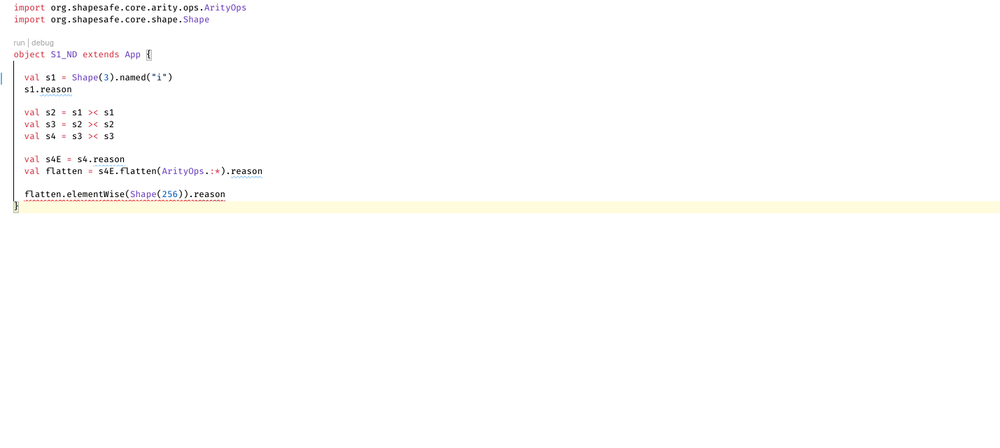
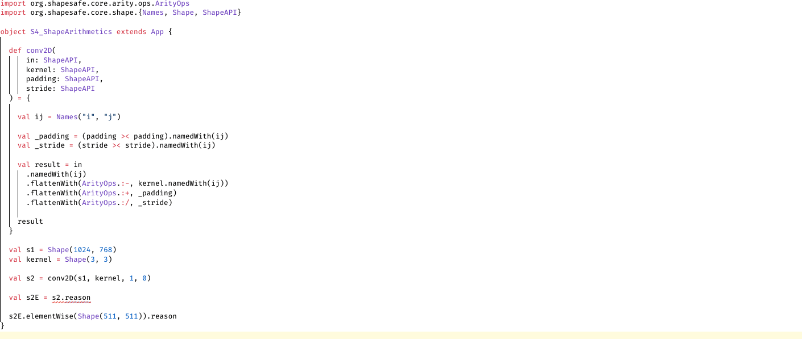
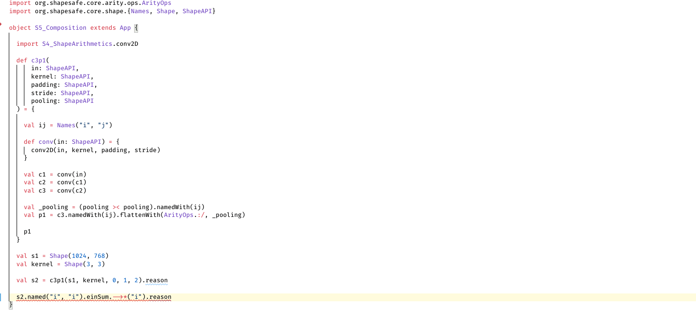

# ∀ Linear Algebra ∃ Proof System between Types

**shapesafe** is the one-size-fits-all compile-time verifier for numerical linear algebra on JVM, obvious shape and indexing errors in tensor operations are captured by scala's typing system.

shapesafe actively proves itself while being written. The following capabilities are introduced at inception:

##### static & runtime-dependent tensor shapes of arbitrary rank



##### named tensor: each dimension is indexed by both its name and ordinal number


##### tensor contractions & operations that depends on index equality, (all cases of EinSum, dot/cross/matrix/hadamard product)


##### operations that depends on shape arithmetics (convolution, direct sum, kronecker product, flatten/reshape)



##### complex function composition, with no implicit scope 



(the above examples are given at https://github.com/tribbloid/shapesafe-demo/tree/main/src/main/scala/org/shapesafe/demo/core/c1)

**It is not a tensor computing library!** Instead, it is designed to be embedded into existing libraries to enable less error-prone prototyping (see Roadmap for possible augmentations).

shapesafe started as an assignment to understand intuitionistic type theory used in compiler design, it minimally depends on [singleton-ops](https://github.com/fthomas/singleton-ops) and [shapeless](https://github.com/milessabin/shapeless).

Support for scala-2.13 is always guaranteed, supports for scala-2.12 & scala-js will only be enforced intermittently and upon request, please create (or vote for) tickets to backport for a specific major version.

### Build Status

| branch \ profile | scala-2.12 | scala-2.13 |
| ---- | ---- | ---- |
| master |  |  |
| (latest in-progress) |  |  |

### Roadmap

##### High priority

- DJL integration

##### Low priority

- DL4j & ND4j integration
- breeze integration (only tensors to up to rank-2 is required)

### How to compile

In POSIX shell, run `./dev/make-all.sh`

Guaranteed to be working by [Continuous Integration](.github/workflows/main.yml)

You must have an installed JDK that supports Gradle 7+ before the compilation

### Architecture

Unlike most of its predecessors, tensor operations in shapesafe are **lazily verified**, and writing expressions requires no definition of implicit type class.
This is a deliberate design which allows complex compositions to be defined with no boilerplate conditions (see [example above](#complex function composition, with no implicit scope )). As a trade-off, shape errors in expressions are suppressed by default, due to the fact that such expressions are still represented as computation graph:

```scala
  val a = Shape(1, 2)
  val b = Shape(3, 4)
  val s1 = (a >< b)
    .named("i", "j")
  s1.peek

// [INFO] 1 >< 2 >< (3 >< 4) |<<- (i >< j)
```

The errors are only captured once the expression is evaluated (e.g. by explicitly calling `.eval` or `.reason`, which does `peek` and `eval` simultaneously):

```scala
  s1.eval

// [ERROR] Dimension mismatch
//
// ... when proving shape ░▒▓
//
// 1 >< 2 >< 3 >< 4 |<<- (i >< j)
```

In the above example, calling `eval` instructs the compiler to summon a chain of type classes as lemmata to prove / refute the correctness of the expression:

|                                         lemma |       | expression                              |
| --------------------------------------------: | :---: | --------------------------------------- |
|                                               |       | (1 >< 2) **><** (3 >< 4) \|<<- (i >< j) |
|                         (prove outer product) |  =    | 1 >< 2 >< 3 >< 4 **\|<<-** (i >< j)     |
| (refute naming of tensor: Dimension mismatch) |  !    |                                         |

Evidently, `eval` can only be used iff each shape operand in the expression (in the above example `a` and `b`)  is either already evaluated, or can be evaluated in the same scope. This is the only case when implicit type classes needs to be defined by the user.

In practice, shapesafe works most efficiently if all input tensors have constant shapes (represented by `org.shapesafe.core.arity.Const`), which can satisfy most architectures in applied linear algebra / ML. Support for variable shape algebra will be gradually enabled in future releases.

##### Upgrade to Scala 3

Most features in shapeless & singleton-ops are taken over by native compiler features:

- shapeless.Witness → singleton type
- shapeless.Poly → polymorphic function
- singleton.ops.== → inline conditions & matches
- singleton.ops._ → scala.compiletime.ops.*
- shapeless.HList → Tuple

... but some are still missing:

- extensible & contractible Record type
  - shapeless.record → ???
  - used to derive output of EinSum & tensor contraction
  - proposed a long time ago: https://github.com/lampepfl/dotty-feature-requests/issues/8, but contraction is still problematic
- Product to Tuple conversion, plus its variants:
  - shapeless.NatProductArgs
  - shapeless.SingletonProductArgs
- ecosystem: Apache Spark, CHISEL, typelevel stack, and much more

### Credit

- [Prof. Dmytro Mitin](https://www.researchgate.net/profile/Dmytro-Mitin) at National Taras Shevchenko University of Kyiv
- All maintainers of [singleton-ops](https://github.com/fthomas/singleton-ops)
- All maintainers of [shapeless](https://github.com/milessabin/shapeless)
- All maintainers of [splain](https://github.com/tek/splain)
- Breandan Considine, maintainer of [Kotlin∇](https://openreview.net/forum?id=SkluMSZ08H)

This project is heavily influenced by Kotlin∇ (see discussion [here](https://github.com/breandan/kotlingrad/issues/11)) and several pioneers in type-safe ML:

- Evan Spark for [first showing the possibility](https://etrain.github.io/2015/05/28/type-safe-linear-algebra-in-scala)
- Tongfei Chen for [Nexus](https://github.com/ctongfei/nexus)
- Maxime Kjaer for [tf-dotty](https://github.com/MaximeKjaer/tf-dotty)

